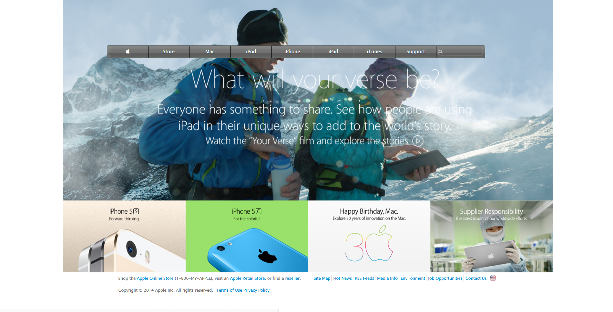

# Archived Apple Home Page Clone

> This project consists of building a web page using images as a background and adding gradients to elements. The objective is to make a clone that matches the appearance an old version of the Apple website homepage. It is a solo project which was developed as a requirement for Microverse HTML and CSS course on the topic Building with Backgrounds and Gradients.

Additional description about the project and its features.
In this project, I made the use of semantic HTML, CSS Grids, Keyframes, and background images that has a link.

## Built With

- Html
- CSS
- Fontawesome

## IDE and Tools

- Visual Studio Code
- Linter

## Live Demo

[Live Demo Link](https://rawcdn.githack.com/temesghentekeste/archived-apple-clone/d32149f4051c13ffdcd225c8e907c6e029b9178c/index.html)

## Getting Started

**Click on the link above in order to see the Live Demo of the front end project.**

To get a local copy up and running follow these simple example steps.

### Prerequisites

- Web Browser
- Text Editor

### Setup

- Download repository files

## Authors

👤 **Author**

- Github: [@temesghentekeste](https://github.com/temesghentekeste)
- Twitter: [@temesghentekes1](https://twitter.com/temesghentekes1)
- Linkedin: [linkedin](https://www.linkedin.com/in/temesghen-tekeste-bahta-8b5243193/)

## 🤝 Contributing

Contributions, issues and feature requests are welcome!

Feel free to check the [issues page]https://github.com/temesghentekeste/archived-apple-clone/issues).

## Show your support

Give a ⭐️ if you like this project!

## Acknowledgments

- Thanks to [Microverse](https://www.microverse.org/) for providing a platform to learn while building projects

## 📝 License

This project is [MIT](lic.url) licensed.

# archived-apple-clone
